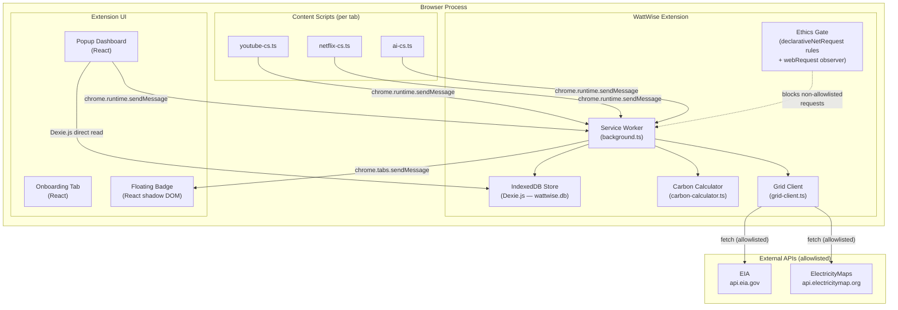
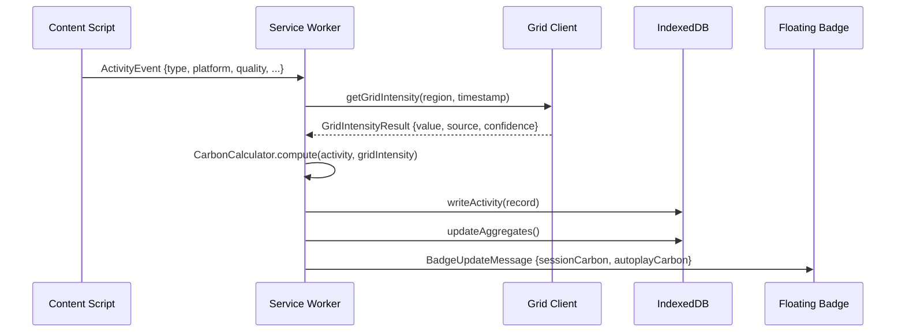

# Design Document — WattWise Chrome Extension

## Overview

WattWise is a privacy-first Chrome extension (Manifest V3) that estimates the carbon footprint of
digital activities in real time. It operates entirely on-device: no browsing history, URLs, or page
content ever leaves the user's machine. Outbound network calls are restricted to two allowlisted
APIs (ElectricityMaps, EIA) and carry only a region code and a timestamp rounded to the nearest
hour.

The extension covers three activity categories in its initial release:

- **Video streaming** — YouTube and Netflix
- **AI prompts** — ChatGPT (chat.openai.com), Claude (claude.ai), Gemini (gemini.google.com)
- **Page loads** — generic web pages

The core value proposition is twofold: (1) make the carbon cost of digital activity visible in
real time via a floating badge and popup dashboard, and (2) help users reduce emissions through
quality-tier comparisons and grid-time scheduling nudges.

### Key Design Decisions

| Decision | Choice | Rationale |
|---|---|---|
| Extension manifest | MV3 | Required for new Chrome extensions; service-worker model |
| UI framework | React + TypeScript | Component reuse across popup, onboarding, badge |
| Build tool | Vite + CRXJS plugin | First-class MV3 support, hot reload in dev |
| Local storage | Dexie.js (IndexedDB wrapper) | Typed schema, promise-based API, works in service workers |
| Network enforcement | `chrome.webRequest` (observe) + `declarativeNetRequest` (block) | DNR blocks non-allowlisted requests declaratively; webRequest used for payload inspection logging |
| Grid data primary | ElectricityMaps `/v3/carbon-intensity/latest` | Best global coverage, zone-level granularity |
| Grid data fallback | EIA Hourly Grid Monitor | US-only fallback; free tier available |
| Property-based testing | fast-check (TypeScript) | Mature library, excellent TypeScript support |

---

## Architecture

### High-Level Component Diagram



### Message Flow

All inter-component communication uses `chrome.runtime.sendMessage` / `chrome.tabs.sendMessage`
with typed message envelopes. The service worker is the single source of truth for state; the
popup reads aggregates directly from IndexedDB for performance (Requirement 7.7 — 500 ms load).



### MV3 Service Worker Lifecycle

MV3 service workers terminate after ~30 seconds of inactivity. WattWise handles this with:

1. **`chrome.alarms`** — a 1-minute repeating alarm keeps the worker alive during active sessions
   and wakes it for scheduled nudge checks.
2. **Stateless design** — all persistent state lives in IndexedDB; the service worker re-hydrates
   from DB on wake-up. In-memory caches (grid intensity, aggregates) are rebuilt on demand.
3. **Port-based keep-alive** — content scripts maintain a long-lived `chrome.runtime.connect`
   port during active video playback, which keeps the service worker alive for the duration.

---

## Components and Interfaces

### 1. Carbon Calculator (`carbon-calculator.ts`)

Pure functions only — no side effects, no I/O. This makes the module fully testable with
property-based tests.

```typescript
// Activity types
type ActivityType = 'video_streaming' | 'ai_prompt' | 'video_call' | 'page_load';
type QualityTier = '480p' | '720p' | '1080p' | '4K';
type DeviceType = 'laptop' | 'desktop' | 'smartphone' | 'tv';
type ConnectionType = 'fixed' | 'cellular_4g';

interface Activity {
  type: ActivityType;
  durationSeconds: number;
  quality?: QualityTier;          // video only
  deviceType: DeviceType;
  connectionType: ConnectionType;
  characterCount?: number;        // AI prompts only
  autoplay?: boolean;
}

interface CarbonResult {
  gCO2e: number;
  energyKWh: number;
  breakdown: {
    networkKWh: number;
    deviceKWh: number;
  };
}

interface QualityComparisonResult {
  tierA: { quality: QualityTier; gCO2e: number };
  tierB: { quality: QualityTier; gCO2e: number };
  percentageDifference: number;   // positive = tierA costs more
}

interface ComparisonAnchors {
  googleSearches: number;
  milesNotDriven: number;
  phoneCharges: number;
  kettlesBoiled: number;
}

// Public API
function computeCarbon(activity: Activity, gridIntensityGCO2ePerKWh: number): CarbonResult;
function compareQualities(
  activity: Omit<Activity, 'quality'>,
  tierA: QualityTier,
  tierB: QualityTier,
  gridIntensityGCO2ePerKWh: number
): QualityComparisonResult;
function toComparisonAnchors(gCO2e: number): ComparisonAnchors;
```

**Energy model constants:**

| Parameter | Value | Source |
|---|---|---|
| 480p data rate | 0.5 GB/hr | Carbon Trust 2021 |
| 720p data rate | 1.5 GB/hr | Carbon Trust 2021 |
| 1080p data rate | 3.0 GB/hr | Carbon Trust 2021 |
| 4K data rate | 7.0 GB/hr | Carbon Trust 2021 |
| Fixed-line energy | 0.077 kWh/GB | Carbon Trust 2021 |
| Cellular 4G energy | 0.21 kWh/GB | IEA 2022 |
| Laptop power | 30 W | Req 1.4 |
| Desktop power | 45 W | Req 1.4 |
| Smartphone power | 3 W | Req 1.4 |
| TV (55" LCD) power | 95 W | Req 1.4 |
| AI tokens per char | 0.25 tokens/char (4 chars/token) | Req 1.5 |
| AI energy per 1k tokens | 0.3 Wh | Ren et al. 2023 |
| Video call energy | 0.002 kWh/min | Obringer et al. 2021 |
| Page load baseline | 1 gCO₂e | Sustainable Web Design |
| Google search | 0.2 gCO₂e | Req 12.1 |
| Mile not driven | 404 gCO₂e | Req 12.1 |
| Phone charge | 8.22 gCO₂e | Req 12.1 |
| Kettle boiled | 50 gCO₂e | Req 12.1 |

### 2. Grid Client (`grid-client.ts`)

Manages fetching, caching, and fallback for grid carbon intensity data.

```typescript
type GridSource = 'electricitymaps' | 'eia' | 'static_fallback';
type GridConfidence = 'high' | 'medium' | 'low';

interface GridIntensityResult {
  gCO2ePerKWh: number;
  source: GridSource;
  confidence: GridConfidence;
  regionCode: string;
  fetchedAt: number;              // Unix ms, rounded to nearest hour for storage
}

interface HourlyForecast {
  hour: number;                   // 0–23 offset from now
  gCO2ePerKWh: number;
  source: GridSource;
  confidence: GridConfidence;
}

// Public API
async function getGridIntensity(regionCode: string, timestamp: number): Promise<GridIntensityResult>;
async function getHourlyForecast(regionCode: string, hoursAhead: number): Promise<HourlyForecast[]>;
```

**Caching strategy:** An in-memory `Map<regionCode, GridIntensityResult>` with a 15-minute TTL.
On service worker restart, the cache is cold; the first call re-fetches. Cache entries are keyed
by `regionCode` only (not timestamp) since the 15-minute window is short enough that stale data
is acceptable.

**Fallback chain:**
1. ElectricityMaps `/v3/carbon-intensity/latest?zone={regionCode}` — confidence: `high`
2. EIA Hourly Grid Monitor (US regions only) — confidence: `medium`
3. Static hourly table bundled in the extension for the top 20 US grid zones — confidence: `low`
4. Global average 475 gCO₂e/kWh (no region configured) — confidence: `low`

**Privacy enforcement:** The Grid Client constructs requests with only `zone` (region code) and
`auth-token` headers. Timestamps sent to APIs are rounded to the nearest hour. The Ethics Gate
provides a second layer of enforcement.

### 3. Service Worker (`background.ts`)

The central coordinator. Responsibilities:

- Receive `ActivityEvent` messages from content scripts
- Invoke `CarbonCalculator.computeCarbon()` with current grid intensity
- Write `ActivityRecord` to IndexedDB via Dexie
- Update rolling aggregates
- Evaluate scheduler nudge conditions
- Relay `BadgeUpdateMessage` to active tabs
- Manage the `chrome.alarms` keep-alive

```typescript
// Message types (discriminated union)
type ExtensionMessage =
  | { type: 'ACTIVITY_START'; payload: ActivityStartPayload }
  | { type: 'ACTIVITY_STOP'; payload: ActivityStopPayload }
  | { type: 'QUALITY_CHANGE'; payload: QualityChangePayload }
  | { type: 'GET_AGGREGATES'; payload: void }
  | { type: 'GET_GRID_FORECAST'; payload: { regionCode: string } }
  | { type: 'CLEAR_DATA'; payload: void }
  | { type: 'SET_REGION'; payload: { regionCode: string } }
  | { type: 'DISMISS_NUDGE'; payload: { activityType: ActivityType } };
```

### 4. Content Scripts

Three content scripts, each injected only into their target domains:

| Script | Matches | Responsibilities |
|---|---|---|
| `youtube-cs.ts` | `*://*.youtube.com/*` | Detect play/pause/stop, quality changes, autoplay flag |
| `netflix-cs.ts` | `*://*.netflix.com/*` | Detect play/pause/stop, quality changes, autoplay flag |
| `ai-cs.ts` | `*://chat.openai.com/*`, `*://claude.ai/*`, `*://gemini.google.com/*` | Detect prompt submission, measure character count |

**Quality detection (YouTube/Netflix):**
1. Poll the player DOM for quality label text (e.g., "1080p", "4K") every 2 seconds during playback
2. Fall back to `video.getVideoPlaybackQuality()` frame statistics as a secondary signal
3. Default to `1080p` if neither source is available

**AI prompt detection:**
- Attach a `submit` / `keydown(Enter)` listener to the prompt form
- Read `textContent.length` of the input field at submission time
- Do NOT capture or store the text itself

**Autoplay detection:**
- YouTube: check `data-autoplay` attribute on the video element and the "Up Next" overlay
- Netflix: check for the post-play countdown overlay in the DOM

### 5. Floating Badge (`floating-badge.tsx`)

A React component injected into active tabs via a content script. Rendered inside a Shadow DOM
to prevent style leakage.

```typescript
interface BadgeState {
  sessionCarbonG: number;
  autoplayCarbonG: number;
  comparisonQuality?: { current: QualityTier; lower: QualityTier; lowerG: number };
  dismissed: boolean;
}
```

- Updates at most every 5 seconds (debounced `BadgeUpdateMessage` from service worker)
- Switches to kg display when `sessionCarbonG >= 100`
- Positioned bottom-right by default; user can drag to reposition (position saved in
  `chrome.storage.local`)
- Dismissed state is per-tab-session (not persisted)

### 6. Popup Dashboard (`popup/`)

React SPA loaded in the extension popup (400 × 600 px). Reads all data directly from IndexedDB
via Dexie for sub-500 ms load time (no service worker round-trip needed for display).

**Panels:**
- **Summary** — session, today, 7-day, 30-day totals
- **Chart** — 7-day bar chart (Recharts library)
- **Breakdown** — activity category breakdown with autoplay line item
- **Grid Schedule** — 24-hour forecast with lowest-carbon window highlighted
- **Comparison Anchors** — two most relatable anchors for 30-day total
- **Savings** — quality-tier savings counter (if enabled)
- **Settings** — region code, category toggles, violations log

### 7. Ethics Gate

Implemented as a two-layer system:

**Layer 1 — `declarativeNetRequest` rules (static, bundled):**
Blocks all outbound requests from the extension whose destination is not `api.electricitymap.org`
or `api.eia.gov`. These rules are evaluated by the browser before the request is sent and cannot
be bypassed by content scripts.

```json
{
  "id": 1,
  "priority": 1,
  "action": { "type": "block" },
  "condition": {
    "initiatorDomains": ["<extension-id>"],
    "excludedRequestDomains": ["api.electricitymap.org", "api.eia.gov"],
    "resourceTypes": ["xmlhttprequest", "other"]
  }
}
```

**Layer 2 — `chrome.webRequest.onBeforeRequest` observer (service worker):**
Inspects the payload of every allowlisted request before it is sent. Checks for PII patterns
(URLs, hostnames, page titles, tab IDs, user identifiers, GPS coordinates, IP addresses, email
addresses, phone numbers, timestamps narrower than one hour). Logs violations to IndexedDB and
surfaces the non-dismissable banner in the popup.

> **Design note:** `declarativeNetRequest` cannot inspect request bodies in MV3. The webRequest
> observer is used for payload inspection and violation logging. The DNR rules provide the
> hard enforcement boundary; the webRequest layer provides audit logging and PII detection.

### 8. IndexedDB Store (`db.ts`)

Dexie.js schema with three tables:

```typescript
class WattWiseDB extends Dexie {
  activities!: Table<ActivityRecord>;
  aggregates!: Table<AggregateRecord>;
  violations!: Table<ViolationRecord>;
  settings!: Table<SettingsRecord>;

  constructor() {
    super('wattwise');
    this.version(1).stores({
      activities: '++id, timestamp, type, platform, autoplay',
      aggregates: 'key',          // key = '1h' | '24h' | '7d' | '30d'
      violations: '++id, timestamp',
      settings: 'key',            // key = 'region' | 'categories' | 'nudgeCooldowns' | ...
    });
  }
}
```

**Purge strategy:** A `chrome.alarms` callback fires daily and deletes all `activities` records
with `timestamp < Date.now() - 30 * 24 * 60 * 60 * 1000`.

---

## Data Models

### ActivityRecord

```typescript
interface ActivityRecord {
  id?: number;                    // auto-increment primary key
  type: ActivityType;             // 'video_streaming' | 'ai_prompt' | 'video_call' | 'page_load'
  platform: string;               // 'youtube' | 'netflix' | 'chatgpt' | 'claude' | 'gemini' | 'generic'
  durationSeconds: number;
  qualityTier?: QualityTier;      // video only
  deviceType: DeviceType;
  connectionType: ConnectionType;
  gCO2e: number;
  gridIntensityUsed: number;      // gCO₂e/kWh at time of activity
  gridIntensitySource: GridSource;
  autoplay: boolean;
  timestamp: number;              // Unix ms, rounded to nearest minute
  // NOT stored: URL, page title, tab ID, prompt text, IP address
}
```

### AggregateRecord

```typescript
interface AggregateRecord {
  key: '1h' | '24h' | '7d' | '30d';
  totalGCO2e: number;
  videoUserGCO2e: number;
  videoAutoplayGCO2e: number;
  aiPromptGCO2e: number;
  videoCallGCO2e: number;
  pageLoadGCO2e: number;
  lastUpdated: number;
}
```

### ViolationRecord

```typescript
interface ViolationRecord {
  id?: number;
  timestamp: number;
  blockedDestination: string;
  ruleViolated: string;
  acknowledged: boolean;
}
```

### SettingsRecord

```typescript
interface SettingsRecord {
  key: string;
  value: unknown;
  // Examples:
  // { key: 'region', value: 'US-AZ-SRP' }
  // { key: 'categories', value: { video: true, ai: true, pageLoad: true } }
  // { key: 'nudgeCooldowns', value: { video_streaming: 1700000000000 } }
  // { key: 'onboardingComplete', value: true }
  // { key: 'qualityComparisonEnabled', value: false }
}
```

### GridIntensityCache (in-memory only, not persisted)

```typescript
interface GridCacheEntry {
  result: GridIntensityResult;
  expiresAt: number;              // fetchedAt + 15 * 60 * 1000
}
// Map<regionCode, GridCacheEntry>
```

### Message Payloads

```typescript
interface ActivityStartPayload {
  type: ActivityType;
  platform: string;
  quality?: QualityTier;
  deviceType: DeviceType;
  connectionType: ConnectionType;
  autoplay: boolean;
  startTimestamp: number;
}

interface ActivityStopPayload {
  platform: string;
  stopTimestamp: number;
}

interface QualityChangePayload {
  platform: string;
  newQuality: QualityTier;
  changeTimestamp: number;
}

interface BadgeUpdateMessage {
  type: 'BADGE_UPDATE';
  sessionCarbonG: number;
  autoplayCarbonG: number;
  comparisonQuality?: {
    current: QualityTier;
    lower: QualityTier;
    lowerG: number;
  };
}
```

---

## Correctness Properties

*A property is a characteristic or behavior that should hold true across all valid executions of a
system — essentially, a formal statement about what the system should do. Properties serve as the
bridge between human-readable specifications and machine-verifiable correctness guarantees.*

### Property 1: Carbon output is always non-negative

*For any* valid `Activity` (any type, any quality tier, any device, any connection type, any
non-negative duration) and any non-negative grid intensity value, `computeCarbon()` SHALL return a
`gCO2e` value that is greater than or equal to zero.

**Validates: Requirements 1.9**

---

### Property 2: Video streaming energy formula correctness

*For any* video streaming activity with a given quality tier, duration, and fixed-line connection,
the computed `networkKWh` SHALL equal `dataRateGB_per_hr[quality] × durationHours × 0.077`. For
cellular (4G) connections, the multiplier SHALL be `0.21` instead of `0.077`. The ratio of
cellular to fixed-line energy SHALL always equal `0.21 / 0.077 ≈ 2.727` for the same activity.

**Validates: Requirements 1.2, 1.3**

---

### Property 3: IEA 2022 tolerance — streaming estimates within 15%

*For any* video streaming activity using the global average grid intensity of 475 gCO₂e/kWh, the
computed `gCO2e` SHALL be within ±15% of the IEA 2022 reference value for that quality tier and
duration.

**Validates: Requirements 1.10**

---

### Property 4: Quality comparison anti-symmetry

*For any* activity and any two distinct quality tiers A and B, the `percentageDifference` returned
by `compareQualities(activity, A, B, gridIntensity)` SHALL equal the negation of
`compareQualities(activity, B, A, gridIntensity).percentageDifference`. Additionally, the
individual `gCO2e` values for each tier SHALL be non-negative.

**Validates: Requirements 1.8**

---

### Property 5: Comparison anchors are non-negative and finite

*For any* non-negative `gCO2e` input, `toComparisonAnchors()` SHALL return an object where every
anchor value (Google searches, miles not driven, phone charges, kettles boiled) is a non-negative,
finite number.

**Validates: Requirements 12.3**

---

### Property 6: Grid client cache prevents redundant network calls

*For any* region code, if `getGridIntensity()` is called twice within a 15-minute window, the
second call SHALL return the same `gCO2ePerKWh` value as the first call and SHALL NOT make an
additional outbound network request. After the 15-minute TTL expires, the next call SHALL make a
fresh network request.

**Validates: Requirements 2.4**

---

### Property 7: Grid intensity response always includes source and confidence

*For any* call to `getGridIntensity()` regardless of which data source is used (ElectricityMaps,
EIA, static fallback, or global average), the returned `GridIntensityResult` SHALL include a
`source` field with a value in `{"electricitymaps", "eia", "static_fallback"}` and a `confidence`
field with a value in `{"high", "medium", "low"}`.

**Validates: Requirements 2.5**

---

### Property 8: Ethics Gate blocks all non-allowlisted destinations

*For any* outbound network request initiated by the extension whose destination domain is not
`api.electricitymap.org` or `api.eia.gov`, the Ethics Gate SHALL block the request before it is
sent, regardless of the request method, path, or payload.

**Validates: Requirements 9.2**

---

### Property 9: Allowlisted request payloads contain only permitted fields

*For any* outbound request that passes the Ethics Gate, the request payload SHALL contain only a
`regionCode`, a timestamp rounded to the nearest hour, and an API authentication token. The payload
SHALL NOT contain any URL or URL fragment, hostname, page title, tab ID, user identifier, GPS
coordinate, IP address, or string matching common PII patterns (email address, phone number).

**Validates: Requirements 9.3, 9.7, 2.6**

---

### Property 10: Activity records never contain privacy-sensitive fields

*For any* `ActivityRecord` written to IndexedDB — regardless of the activity type, platform, or
content of the originating page — the record SHALL NOT contain a URL, page title, tab ID, prompt
text, or IP address.

**Validates: Requirements 8.5**

---

### Property 11: Aggregate totals equal sum of individual records

*For any* sequence of activity events committed to IndexedDB, each rolling aggregate total
(`1h`, `24h`, `7d`, `30d`) SHALL equal the arithmetic sum of `gCO2e` values of all
`ActivityRecord` entries whose `timestamp` falls within the corresponding time window.

**Validates: Requirements 8.3**

---

### Property 12: Autoplay activities are attributed to the autoplay bucket

*For any* `ActivityRecord` with `autoplay: true`, its `gCO2e` value SHALL be included in
`videoAutoplayGCO2e` in the aggregate and SHALL NOT be included in `videoUserGCO2e`. Conversely,
*for any* record with `autoplay: false`, its `gCO2e` SHALL be included in `videoUserGCO2e` and
not in `videoAutoplayGCO2e`.

**Validates: Requirements 11.1**

---

### Property 13: Scheduler nudge fires if and only if a 30% savings window exists

*For any* video activity with duration greater than 20 minutes and any 24-hour grid intensity
forecast, a `Scheduler_Nudge` SHALL be surfaced if and only if: (a) there exists at least one
future hour in the forecast whose grid intensity would reduce the activity's carbon cost by 30% or
more compared to the current hour, AND (b) the grid data confidence is `"medium"` or `"high"`.

**Validates: Requirements 6.1, 6.2, 6.6**

---

### Property 14: Nudge cooldown prevents repeat nudges within 2 hours

*For any* activity type, after a `Scheduler_Nudge` is dismissed by the user, no further nudge
SHALL be surfaced for that activity type for any activity event received within the next 2 hours.

**Validates: Requirements 6.4**

---

### Property 15: Badge unit switches at 100 gCO₂e threshold

*For any* session carbon total strictly below 100 gCO₂e, the Floating_Badge SHALL display the
value in grams (e.g., "42 g"). *For any* session carbon total at or above 100 gCO₂e, the badge
SHALL display the value in kilograms (e.g., "0.10 kg"). The threshold is inclusive at 100 gCO₂e.

**Validates: Requirements 5.3**

---

### Property 16: AI prompt character count is captured but prompt text is not

*For any* prompt submission on any supported AI platform, the emitted `ActivityStartPayload` SHALL
contain a `characterCount` field (a non-negative integer) and SHALL NOT contain the prompt text
itself or any substring of the prompt text.

**Validates: Requirements 4.2**

---

## Error Handling

### Grid Client Errors

| Scenario | Handling |
|---|---|
| ElectricityMaps API timeout (>5 s) | Fall back to EIA; log warning |
| ElectricityMaps 4xx/5xx | Fall back to EIA; log warning |
| EIA API unreachable | Fall back to static hourly table |
| No region configured | Use 475 gCO₂e/kWh global average; surface one-time setup prompt |
| Static table missing zone | Use 475 gCO₂e/kWh global average; confidence = `low` |

### Content Script Errors

| Scenario | Handling |
|---|---|
| DOM quality label not found | Fall back to `getVideoPlaybackQuality()`; then default to 1080p |
| AI prompt input field not detectable | Log detection failure locally; skip activity event |
| Service worker not responding | Retry `sendMessage` up to 3 times with 500 ms backoff |
| Shadow DOM injection blocked by CSP | Gracefully skip badge injection; tracking continues |

### Service Worker Errors

| Scenario | Handling |
|---|---|
| IndexedDB write failure | Retry up to 3 times; log error; do not lose the activity event |
| Service worker terminated mid-activity | On restart, check for open activity sessions in IndexedDB and close them with estimated duration |
| Aggregate update failure | Re-compute aggregates from raw activity log on next startup |

### Ethics Gate Violations

When a violation is detected:
1. The request is blocked immediately
2. A `ViolationRecord` is written to IndexedDB with timestamp, destination, and rule violated
3. The popup displays a non-dismissable banner until the user acknowledges it in settings
4. The violation is never reported to any external service

### Onboarding Incomplete

If the user closes the onboarding tab without completing setup:
- `onboardingComplete` setting remains `false`
- Grid intensity defaults to 475 gCO₂e/kWh
- Popup displays a persistent "Complete setup" prompt
- Tracking begins immediately with default values

---

## Testing Strategy

### Dual Testing Approach

WattWise uses a combination of property-based tests and example-based unit tests:

- **Property-based tests** (fast-check): verify universal correctness properties of the
  `CarbonCalculator`, `GridClient` cache logic, `EthicsGate` payload inspection, and
  `IndexedDB` aggregate consistency. Each property test runs a minimum of **100 iterations**.
- **Unit tests** (Vitest): verify specific examples, edge cases, integration points, and
  UI component behavior.
- **Integration tests**: verify the full message-passing pipeline from content script to
  service worker to IndexedDB using a mocked Chrome API environment (jest-chrome or
  `chrome-mock`).

### Property-Based Test Configuration

```typescript
// fast-check configuration
fc.configureGlobal({ numRuns: 100 });

// Tag format for each property test:
// Feature: stream-tax, Property N: <property_text>
```

### Test Coverage by Component

| Component | Test Type | Key Scenarios |
|---|---|---|
| `CarbonCalculator` | Property (fast-check) | Non-negative output, IEA tolerance, anchor finiteness, comparison symmetry |
| `GridClient` | Property + Unit | Cache TTL, fallback chain, privacy field exclusion |
| `EthicsGate` | Property + Unit | Allowlist enforcement, PII pattern detection, payload field validation |
| `IndexedDB aggregates` | Property | Aggregate consistency with arbitrary event sequences |
| `SchedulerNudge` | Property + Unit | Threshold correctness, cooldown enforcement |
| `FloatingBadge` | Unit (Vitest + React Testing Library) | Unit switching, dismissal, quality comparison display |
| `PopupDashboard` | Unit | Panel rendering, 500 ms load constraint |
| Content scripts | Integration | Play/pause/quality-change detection with DOM mocks |
| Onboarding | Unit | Screen navigation, region persistence, incomplete-flow fallback |

### Performance Tests

- Content script injection time: measured with `performance.now()` in CI, must be ≤ 50 ms
- Service worker event processing: measured end-to-end, must be ≤ 500 ms
- Popup load time: measured with `performance.now()`, must be ≤ 500 ms

### Privacy Regression Tests

A dedicated test suite verifies that no `ActivityRecord` written to IndexedDB contains any of the
prohibited fields (URL, page title, tab ID, prompt text, IP address). These tests run on every
commit as part of CI.
