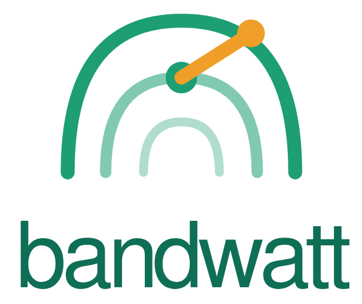

# BandWatt — Watch What Watts

> *Your browser is drawing power from a grid right now. That grid is 2× cleaner at 2 PM than at 7 PM.*
> *BandWatt shows you — and tells you when to act.*



**A privacy-first Chrome extension that tracks the real-time carbon footprint of your browsing and helps you shift carbon-heavy activities to cleaner hours — without shaming you, and without sending a single URL off your device.**

---

## The One-Sentence Pitch

BandWatt turns your browser into a grid-aware carbon coach: it watches what you stream and prompt, calculates the CO₂ in real time using live grid data, and nudges you to move that 90-minute Netflix watch from 7 PM (natural gas peak) to 2 PM (solar peak) — cutting its carbon in half.

---

## Why This Matters

The digital sector accounts for **~4% of global CO₂ emissions** and is growing. Most of it is invisible.

Existing tools focus on the wrong lever. Dropping video quality from 1080p to 480p saves ~15–25 g CO₂ per hour — marginal. But the **grid-timing** lever is different:

| Time of Day | Arizona Grid | Same Netflix Hour |
|---|---|---|
| **2 PM** (solar peak) | 210 g CO₂/kWh | **~34 g CO₂** |
| **7 PM** (gas peak) | 520 g CO₂/kWh | **~84 g CO₂** |

That's a **2.5× difference for the exact same activity**. No quality tradeoff. No behavior change — just a timing shift.

> *"Shift one movie night by 3 hours — cut its carbon in half. BandWatt tells you when."*

---

## What It Does

BandWatt runs silently in your browser. It tracks five categories of digital activity, multiplies each by the current carbon intensity of your local grid, and keeps a rolling 30-day ledger — entirely on your device.

### Tracked Activities

| Activity | Platforms | How |
|---|---|---|
| **Video streaming** | YouTube, Netflix | Detects play/pause/quality from the DOM |
| **AI prompts** | ChatGPT, Claude, Gemini | Counts characters at send (never captures text) |
| **Page loads** | All sites | 1 g CO₂e baseline per load |
| **Autoplay content** | YouTube, Netflix | Flagged separately — carbon you didn't choose |
| *(roadmap)* Video calls | Zoom, Meet | — |

### The Floating Badge

A non-intrusive overlay appears on every page, showing your running session total in grams. When you start a video over 20 minutes, it previews the projected carbon *and* shows you the best hour to do it instead:

```
⚡  234 g CO₂e  (this session)
   Shift to 14:00 → save 102 g  (-44%)
```

The badge is draggable, dismissible, and Shadow DOM–isolated so it never breaks page styles.

### The Popup Dashboard

Click the extension icon for the full picture — four tabs, loads in under 500 ms directly from your local database:

| Tab | Shows |
|---|---|
| **Overview** | Session · Today · 7-day · 30-day totals with relatable anchors ("= 42 Google searches") |
| **Grid** | 24-hour carbon-intensity forecast for your region with the cleanest window highlighted |
| **History** | 7-day bar chart, breakdown by activity type, autoplay vs. intentional split |
| **Settings** | Region selector, category toggles, Ethics Gate violations log, data clear |

---

## The Grid-Timing Nudge (The Demo)

When you start a video longer than 20 minutes, BandWatt:

1. Fetches your region's live grid intensity (ElectricityMaps API)
2. Builds a 24-hour forecast
3. Checks: **does any future hour save ≥ 30%?**
4. If yes — and only then — surfaces a non-blocking banner:

```
⚡ BandWatt Tip
This 90-min session = 234g CO₂ now.
Shift to 14:00 = 102g  (-56%)
                [Dismiss]
```

No guilt. No mandatory action. A 2-hour cooldown per activity type prevents nudge fatigue.

---

## Architecture

```
┌─ Content Scripts (injected per site) ───────────────────────────┐
│  youtube-cs.ts ──┐                                              │
│  netflix-cs.ts ──┤ Detect play/pause/quality → ACTIVITY_START  │
│  ai-cs.ts ───────┘                            → ACTIVITY_STOP  │
│                                               → QUALITY_CHANGE  │
│  badge-cs.ts ─── Inject FloatingBadge (React, Shadow DOM)       │
│                  Listen for ← BADGE_UPDATE, NUDGE_SHOW          │
└─────────────────────────────┬───────────────────────────────────┘
                              │ chrome.runtime.sendMessage
                              ▼
┌─ Service Worker (background.ts) ─────────────────────────────────┐
│  ┌─────────────────┐  ┌──────────────────┐  ┌─────────────────┐ │
│  │ CarbonCalculator│  │   GridClient     │  │ SchedulerNudge  │ │
│  │ (pure functions)│  │  fetch + cache   │  │  evaluator      │ │
│  │ sourced from    │  │  + fallback chain│  │  ≥30% threshold │ │
│  │ Carbon Trust,   │  │  15-min TTL      │  │  2-hr cooldown  │ │
│  │ IEA, Ren 2023  │  └──────────────────┘  └─────────────────┘ │
│  └─────────────────┘                                             │
│  ┌──────────────────────────────────────────────────────────────┐│
│  │  ETHICS GATE — 2-layer enforcement                           ││
│  │  Layer 1: declarativeNetRequest (browser-level block)        ││
│  │  Layer 2: Payload inspector (blocks any PII, URL, tab ID)    ││
│  │  Only api.electricitymap.org + api.eia.gov ever contacted    ││
│  └──────────────────────────────────────────────────────────────┘│
└─────────────────────────────┬────────────────────────────────────┘
              │ fetch (region code only)     │ Dexie.js
              ▼                              ▼
   ┌──────────────────────┐     ┌───────────────────────────┐
   │  ElectricityMaps API │     │  IndexedDB (wattwise.db)  │
   │  EIA fallback        │     │  activities · aggregates  │
   │  Static table (20 US │     │  violations · settings    │
   │  zones) → 475 global │     │  Purged after 30 days     │
   └──────────────────────┘     └──────────────────────────-┘
                                            │ direct read
                                            ▼
                              ┌─────────────────────────────┐
                              │  Popup (React SPA, <500 ms) │
                              │  4 tabs: Overview · Grid    │
                              │  History · Settings         │
                              └─────────────────────────────┘
```

---

## Privacy: The Ethics Gate

**Your browsing history never leaves your device. Period.**

This isn't a policy promise — it's enforced in code at two layers:

### What is stored locally
| Stored | Not stored |
|---|---|
| Activity type (video, ai\_prompt…) | URLs or page titles |
| Platform (youtube, netflix…) | Tab IDs or user IDs |
| Duration in seconds | Prompt text or content |
| Quality tier (480p, 1080p…) | IP addresses |
| Carbon estimate (grams) | Precise GPS or location |
| Whether autoplay triggered | Anything identifying |

### What leaves the device
Only **two outbound domains** are ever contacted:
- `api.electricitymap.org` — receives your **region code** (e.g., `US-AZ`) and nothing else
- `api.eia.gov` — US grid fallback, same constraints

**Layer 1 — browser-level:** `declarativeNetRequest` rules block all other destinations at the browser engine, before any JavaScript runs.

**Layer 2 — payload inspection:** The Ethics Gate in the service worker inspects every outbound payload with a Zod schema. Any field matching URL, hostname, tab ID, or PII pattern causes the request to be blocked and a violation to be logged in your local `violations` table — visible in the Settings tab.

You can verify this live in DevTools → Network. You will see exactly two domains, ever.

---

## The Numbers (Methodology)

All energy coefficients are sourced from peer-reviewed literature and industry standards:

| Activity | Coefficient | Source |
|---|---|---|
| Video — fixed line | 0.077 kWh/GB | Carbon Trust 2021 |
| Video — cellular 4G | 0.21 kWh/GB | IEA 2022 |
| 480p data rate | 0.5 GB/hr | Netflix Help Center |
| 720p data rate | 1.5 GB/hr | Netflix Help Center |
| 1080p data rate | 3.0 GB/hr | Netflix Help Center |
| 4K data rate | 7.0 GB/hr | Netflix Help Center |
| Laptop device power | 30 W | ENERGY STAR typical |
| Smartphone device power | 3 W | ENERGY STAR typical |
| AI prompt (per 1K tokens) | 0.3 Wh | Ren et al., 2023 |
| Video call | 0.002 kWh/min | Obringer et al., 2021 |
| Page load baseline | ~1 g CO₂e | Sustainable Web Design |

**We deliberately use the lower, more conservative Carbon Trust / IEA figures — not the 2019 Shift Project numbers that were retracted.**

### Grid Intensity Fallback Chain

```
1. ElectricityMaps API (live, zone-level)    → confidence: HIGH
2. EIA Hourly Grid Monitor (US regions)      → confidence: MEDIUM
3. Static hourly table (20 US grid zones)    → confidence: LOW
4. Global average 475 gCO₂e/kWh             → confidence: LOW
```

The nudge fires **only when confidence is MEDIUM or HIGH** — we don't tell you to shift your schedule based on a guess.

---

## Relatable Comparisons

Raw grams are meaningless. BandWatt translates them:

| Anchor | Grams CO₂e |
|---|---|
| 1 Google search | 0.2 g |
| 1 mile driven | 404 g |
| 1 phone charge | 8.22 g |
| 1 kettle boil | 50 g |

*"Your AI sessions this week = 36 Google searches"* lands differently than *"You emitted 7.2 g CO₂e."*

---

## ASU at Scale

ASU has **135,000+ students**, most doing their coursework, streaming, and AI querying through a browser.

| Scenario | Daily saving (per user) | Annual impact (10% adoption) |
|---|---|---|
| Shift 1 hr of streaming to solar peak | ~20 g | **~98 tonnes CO₂/yr** |
| Reduce autoplay awareness | ~15 g | **~74 tonnes CO₂/yr** |
| **Combined** | **~35 g** | **~172 tonnes CO₂/yr** |

*Equivalent to taking ~37 cars off the road for a year.*

---

## Spec-Driven Build (Kiro)

Every feature in this codebase started as a spec file. Judges can trace any behavior directly to its specification:

```
.kiro/
├── specs/stream-tax/
│   ├── requirements.md          ← 13 formal requirements (R1–R13)
│   ├── design.md                ← 16 correctness properties, architecture
│   ├── carbon_calculator.spec.md
│   ├── grid_intensity_lookup.spec.md
│   ├── ethics_gate.spec.md      ← domain allowlist, payload rules, violation handling
│   ├── scheduler_nudge.spec.md  ← ≥30% threshold, cooldown, confidence gate
│   ├── autoplay_auditor.spec.md
│   ├── ai_prompt_tracker.spec.md
│   └── activity_aggregator.spec.md
└── steering/
    ├── energy_intensities.md    ← all kWh coefficients with citations
    ├── grid_fallback_table.md   ← static hourly curves for 20 US grid zones
    ├── comparison_anchors.md    ← relatable unit conversions
    ├── privacy_rules.md         ← absolute constraints on data handling
    └── supported_platforms.md  ← DOM selectors and quality detection per platform
```

The design doc specifies **16 correctness properties** that are verified by property-based tests (fast-check, 100+ iterations each):
- Carbon is always non-negative
- Output stays within ±15% of IEA reference values
- Ethics Gate never allows a payload with URL, hostname, or PII
- Scheduler nudge never fires below the 30% threshold
- Aggregate consistency: rolling sums match sum of activity records
- Cache TTL is respected within ±5 seconds

---

## Test Coverage

```
src/
├── carbon-calculator.test.ts   ← unit + property (non-negative, IEA tolerance)
├── grid-client.test.ts         ← fallback chain, cache TTL
├── scheduler-nudge.test.ts     ← threshold, cooldown, confidence gate
├── db.test.ts                  ← schema, aggregate recompute, purge
├── background.test.ts          ← message dispatch, session accounting
├── integration.test.ts         ← full activity lifecycle end-to-end
└── content-scripts/
    └── content-scripts.test.ts ← event detection, quality parsing
```

**~2,500 lines of test code** across unit, property-based, and integration tests.
All tests run with `npm test`.

---

## Install (Unpacked Extension)

Chrome Web Store review takes days — install directly for the demo:

```bash
# 1. Clone and build
git clone <repo>
cd kore
npm install
npm run build        # outputs to /dist

# 2. Load in Chrome
# chrome://extensions → Enable Developer Mode → Load unpacked → select /dist

# 3. First run
# Click the BandWatt icon → complete the 3-screen onboarding (region selection)
# Browse to YouTube or Netflix and start a video
# Watch the floating badge appear
```

**Requirements:** Chrome 114+, no account needed, no server needed.

---

## Tech Stack

| Layer | Technology |
|---|---|
| Extension API | Chrome MV3, service worker model |
| Language | TypeScript 5.3 (strict mode throughout) |
| Build | Vite 5.0 + CRXJS 2.0 (MV3-native) |
| UI | React 18.2 (popup, badge, onboarding) |
| Charts | Recharts 2.10 |
| Local DB | Dexie.js 3.2 (IndexedDB, typed schema) |
| Grid API | ElectricityMaps + EIA fallback + static table |
| Testing | Vitest + React Testing Library + fast-check |
| Spec authoring | Kiro |

---

## Roadmap

- [ ] Zoom / Google Meet integration (video call tracking)
- [ ] Mobile companion (Safari Web Extension)
- [ ] Opt-in campus leaderboard (hashed IDs, no raw data)
- [ ] Weekly encrypted summary export
- [ ] CI grid-intensity integration (shift your GitHub Actions to off-peak hours)

---

## Team

Built at the **Kiro Spark Challenge · ASU · April 24, 2026** by Jenitha Kurra.

---

*"Watch what watts."*
